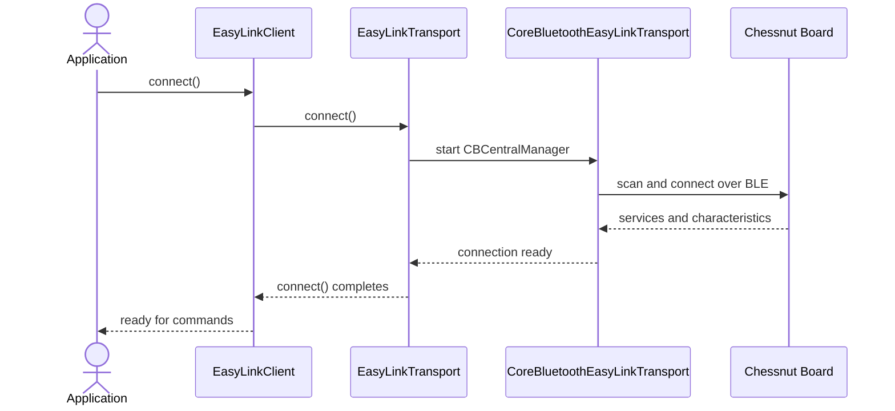
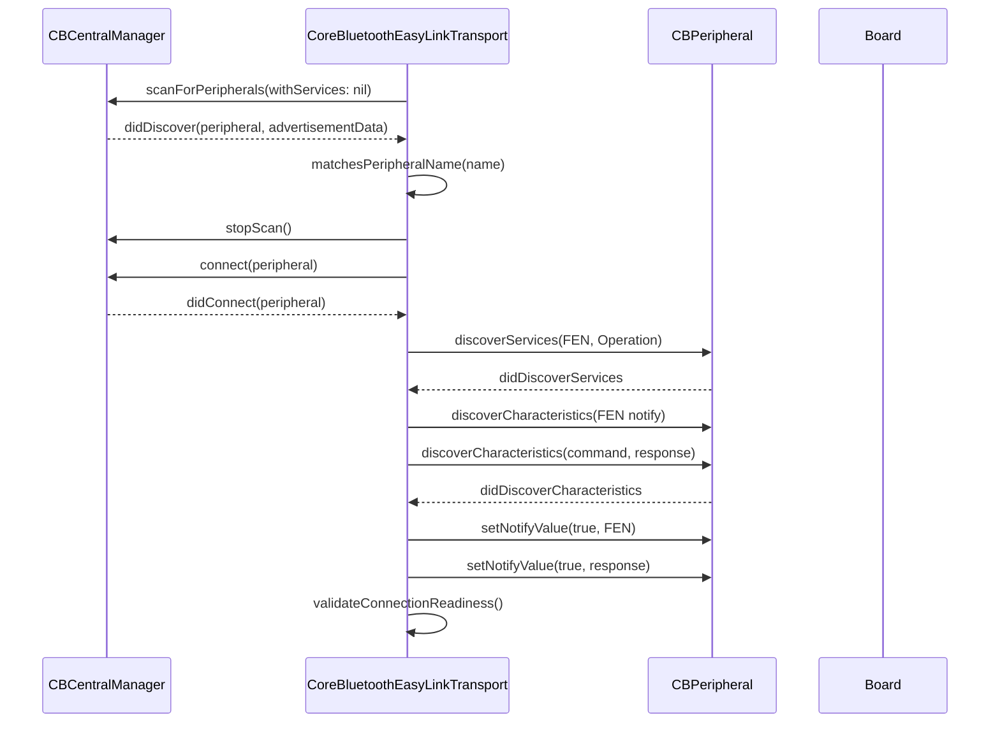
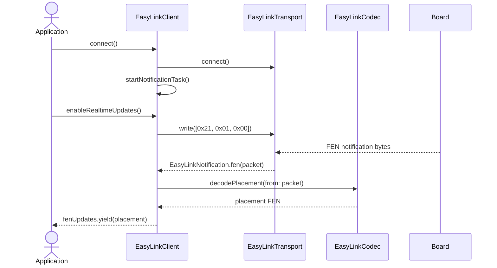
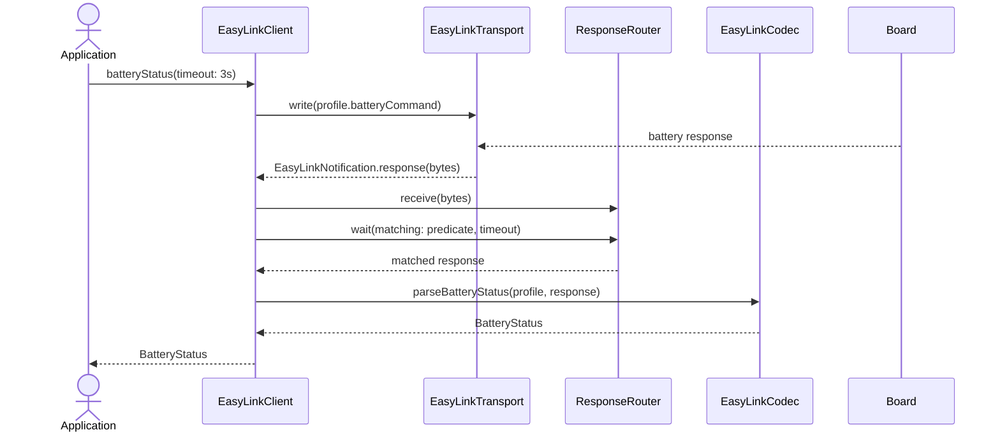
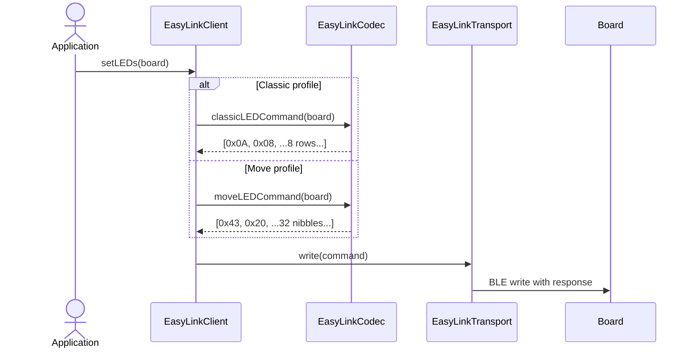
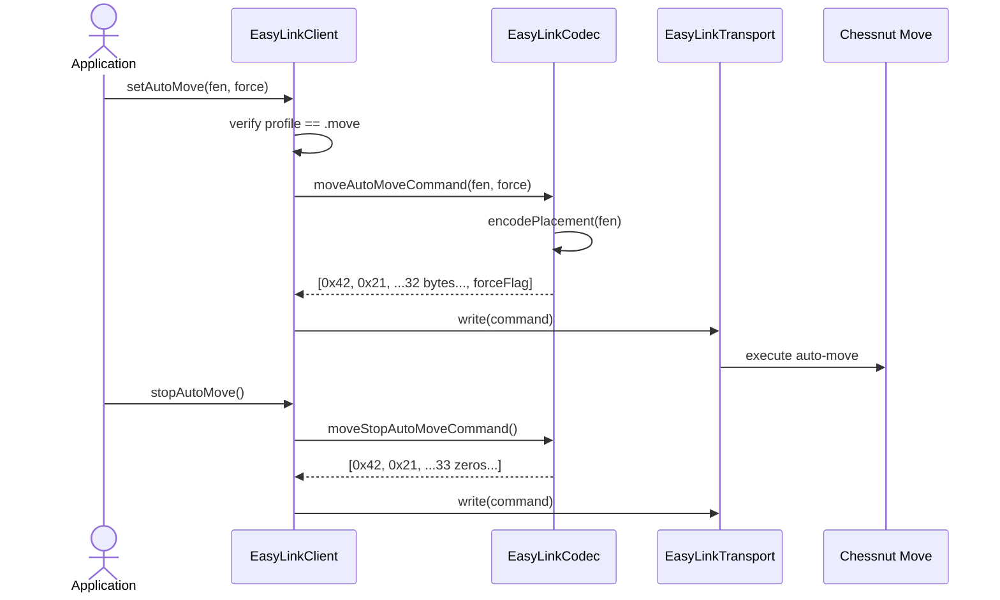
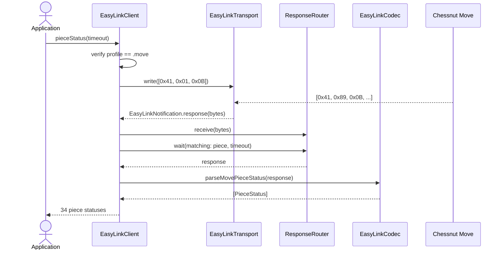
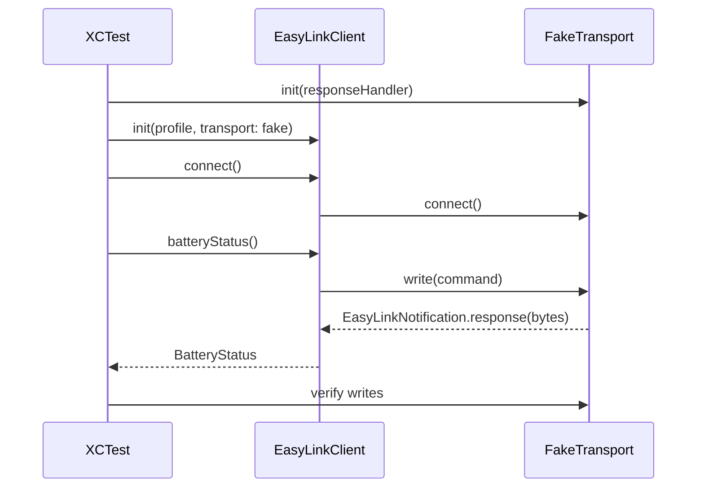

# EasyLinkSwiftSDK - English Documentation

`EasyLinkSwiftSDK` is a native Swift library for communicating with Chessnut electronic chessboards over Bluetooth Low Energy (BLE). The package is implemented as a Swift Package Manager library, does not wrap the original C/C++ SDK, and exposes an `async/await` API with `AsyncStream` for realtime updates.

## Package Overview

- Package name: `EasyLinkSwiftSDK`
- SPM product: `EasyLinkSwiftSDK` library
- Supported platforms: iOS 16 or later and macOS 13 or later
- Included transport: CoreBluetooth
- Supported profiles:
  - `BoardProfile.classic`: Chessnut Air, Air+, Go, and Pro style boards.
  - `BoardProfile.move`: Chessnut Move.
- Included tests:
  - `EasyLinkCodecTests`: validate protocol encoding and decoding.
  - `EasyLinkClientTests`: validate client flows with a fake transport.

## Project Structure

| Path | Responsibility |
| --- | --- |
| `Package.swift` | Defines the SPM package, platforms, library product, and test target. |
| `README.md` | Short summary of profiles, UUIDs, commands, and basic usage. |
| `Sources/EasyLinkSwiftSDK/EasyLinkClient.swift` | Main public facade for connecting, sending commands, and consuming FEN updates. |
| `Sources/EasyLinkSwiftSDK/CoreBluetoothEasyLinkTransport.swift` | Real BLE implementation using `CBCentralManager` and `CBPeripheralDelegate`. |
| `Sources/EasyLinkSwiftSDK/EasyLinkTransport.swift` | Injectable transport protocol for testing or replacing CoreBluetooth. |
| `Sources/EasyLinkSwiftSDK/EasyLinkCodec.swift` | Encoder and decoder for Chessnut protocol bytes. |
| `Sources/EasyLinkSwiftSDK/Models.swift` | Public models: profile, LED colors, LED board, battery, and piece status. |
| `Sources/EasyLinkSwiftSDK/ResponseRouter.swift` | Internal actor that matches BLE responses with pending calls. |
| `Sources/EasyLinkSwiftSDK/EasyLinkNotification.swift` | Transport events: FEN, response, and disconnection. |
| `Sources/EasyLinkSwiftSDK/EasyLinkError.swift` | Public library errors. |
| `Sources/EasyLinkSwiftSDK/ProtocolConstants.swift` | BLE UUIDs, constant commands, and profile detection rules. |
| `Tests/EasyLinkSwiftSDKTests/FakeTransport.swift` | Fake transport for unit tests without BLE hardware. |

## Installation

Add the package to your Swift Package Manager project:

```swift
.package(url: "REPOSITORY_URL", branch: "main")
```

Then declare the dependency in the target that uses it:

```swift
.product(name: "EasyLinkSwiftSDK", package: "EasyLinkSwiftSDK")
```

## Basic Usage

```swift
import EasyLinkSwiftSDK

let client = EasyLinkClient(profile: .move)

try await client.connect()
try await client.enableRealtimeUpdates()

Task {
  for await fen in client.fenUpdates {
    print("Board position:", fen)
  }
}

let battery = try await client.batteryStatus()
print("Battery:", battery.percentage)
```

The `fenUpdates` property emits only the placement field of a FEN string, for example:

```text
rnbqkbnr/pppppppp/8/8/8/8/PPPPPPPP/RNBQKBNR
```

It does not include side to move, castling rights, en passant target, halfmove clock, or fullmove number.

## General Architecture

The library is organized into three layers:

1. High-level public API: `EasyLinkClient`.
2. BLE or injected transport: `EasyLinkTransport` and `CoreBluetoothEasyLinkTransport`.
3. Byte protocol: `EasyLinkCodec`, `ProtocolConstants`, and `ResponseRouter`.

`EasyLinkClient` does not talk directly to CoreBluetooth. It sends commands to any object implementing `EasyLinkTransport`, which makes the library testable with `FakeTransport` and allows alternative transports. The client is an actor, so its mutable task state is protected by actor isolation instead of locks.



## Board Profiles

### `BoardProfile.classic`

Profile for classic Chessnut boards, detected by a BLE name that starts with `Chessnut` and is not exactly `Chessnut Move`.

Available functionality:

- BLE connection.
- Realtime FEN updates.
- Monochrome per-square LEDs.
- Battery status query.

Main commands:

| Function | Bytes |
| --- | --- |
| Enable realtime FEN | `[0x21, 0x01, 0x00]` |
| LEDs | `[0x0A, 0x08, ...8 bytes...]` |
| Battery request | `[0x29, 0x01, 0x00]` |
| Expected battery response | `[0x2A, 0x02, batteryLevel, reserved]` |

### `BoardProfile.move`

Profile for Chessnut Move, detected by a BLE name exactly equal to `Chessnut Move`.

Available functionality:

- BLE connection.
- Realtime FEN updates.
- Colored per-square LEDs.
- Battery status query.
- Auto-move from a FEN position.
- Stop auto-move.
- Individual piece status query.

Main commands:

| Function | Bytes |
| --- | --- |
| Enable realtime FEN | `[0x21, 0x01, 0x00]` |
| Auto-move | `[0x42, 0x21, ...32 board bytes..., forceFlag]` |
| Stop auto-move | `[0x42, 0x21, ...33 zero bytes...]` |
| Color LEDs | `[0x43, 0x20, ...32 LED bytes...]` |
| Battery request | `[0x41, 0x01, 0x0C]` |
| Expected battery response | `[0x41, 0x03, 0x0C, charging, batteryLevel]` |
| Piece status request | `[0x41, 0x01, 0x0B]` |
| Expected piece status response | `[0x41, 0x89, 0x0B, ...34 four-byte records...]` |

## BLE Services and Characteristics

Both profiles use the same BLE UUIDs:

| Element | UUID |
| --- | --- |
| FEN service | `1b7e8261-2877-41c3-b46e-cf057c562023` |
| FEN notification characteristic | `1b7e8262-2877-41c3-b46e-cf057c562023` |
| Operation service | `1b7e8271-2877-41c3-b46e-cf057c562023` |
| Command characteristic | `1b7e8272-2877-41c3-b46e-cf057c562023` |
| Response characteristic | `1b7e8273-2877-41c3-b46e-cf057c562023` |

`CoreBluetoothEasyLinkTransport` scans for peripherals, filters by name according to the selected profile, connects, discovers the services above, stores the command characteristic, and enables notifications on the FEN and response characteristics.



## Main Public API

### `EasyLinkClient`

This is the recommended entry point for consumers of the library.

Properties:

- `profile`: selected board profile.
- `fenUpdates`: `AsyncStream<String>` with realtime positions.

Initializers:

```swift
public init(profile: BoardProfile)
public init(profile: BoardProfile, transport: EasyLinkTransport)
```

The profile-only initializer uses `CoreBluetoothEasyLinkTransport`. The initializer that accepts a `transport` allows injecting a custom transport for tests, simulators, or alternative integrations.

Methods:

| Method | Purpose |
| --- | --- |
| `connect()` | Connects the transport and starts the internal notification-processing task. |
| `disconnect()` | Cancels the notification task and disconnects the transport. |
| `enableRealtimeUpdates()` | Sends the command that enables realtime FEN notifications. |
| `setLEDs(_:)` | Encodes and sends LEDs according to the active profile. |
| `batteryStatus(timeout:)` | Sends a battery request and waits for the matching response. |
| `setAutoMove(fen:force:)` | Chessnut Move only. Sends a position for auto-move. |
| `stopAutoMove()` | Chessnut Move only. Stops auto-move. |
| `pieceStatus(timeout:)` | Chessnut Move only. Returns the status of 34 pieces. |

### FEN Update Flow



If FEN decoding fails inside the notification task, the packet is ignored because decoding uses `try?`.

### Battery Query Flow



`ResponseRouter` accepts responses that arrive before or after the `wait` call. If a response arrives before a compatible wait exists, it is stored in an internal buffer.

### LED Flow



In `classic`, any color other than `.off` is translated into an enabled LED bit for that row. In `move`, each square is encoded as a color nibble:

| `LEDColor` | Value |
| --- | --- |
| `.off` | `0` |
| `.red` | `1` |
| `.green` | `2` |
| `.blue` | `3` |

### Chessnut Move Auto-Move Flow



Calling `setAutoMove` or `stopAutoMove` with the `.classic` profile throws `EasyLinkError.unsupportedCommand(.classic)`.

### Chessnut Move Piece Status Flow



Each `PieceStatus` contains:

- `index`: record index.
- `piece`: expected piece for that index.
- `identityCode`: physical identifier or identity code reported by the board.
- `x`: reported X coordinate.
- `y`: reported Y coordinate.
- `batteryPercentage`: battery level for that piece.

## Public Models

### `BoardProfile`

```swift
public enum BoardProfile: Sendable, Equatable {
  case classic
  case move
}
```

Selects the command protocol and peripheral detection rules.

### `LEDColor`

```swift
public enum LEDColor: UInt8, Sendable, Equatable {
  case off = 0
  case red = 1
  case green = 2
  case blue = 3
}
```

Represents the colors supported by the LED API. On classic boards, only on/off is used.

### `LEDBoard`

```swift
public struct LEDBoard: Sendable, Equatable {
  public private(set) var colors: [[LEDColor]]
}
```

Represents an 8x8 color matrix. The initializer validates that there are 8 rows and 8 columns. It also includes:

- `LEDBoard.allOff`: fully off board.
- `subscript(rankIndex:fileIndex:)`: reads and writes one square.

Example:

```swift
var board = LEDBoard.allOff
board[rankIndex: 0, fileIndex: 7] = .blue
try await client.setLEDs(board)
```

### `BatteryStatus`

```swift
public struct BatteryStatus: Sendable, Equatable {
  public var percentage: Int
  public var isCharging: Bool?
}
```

For both profiles, the SDK attempts to return a percentage. `isCharging` can represent charging state if the protocol reports it or if it can be inferred from the received byte.

### `PieceStatus`

```swift
public struct PieceStatus: Sendable, Equatable {
  public var index: Int
  public var piece: Character
  public var identityCode: UInt8
  public var x: UInt8
  public var y: UInt8
  public var batteryPercentage: Int
}
```

Used only for Chessnut Move. The parser expects 34 four-byte records.

## Protocol Encoding and Decoding

### FEN

`EasyLinkCodec.decodePlacement(from:)` expects packets with at least 34 bytes. Placement is read from bytes `[2]...[33]`, two squares per byte, using nibbles.

Piece table:

| Code | Piece |
| --- | --- |
| `0` | empty square |
| `1` | `q` |
| `2` | `k` |
| `3` | `b` |
| `4` | `p` |
| `5` | `n` |
| `6` | `R` |
| `7` | `P` |
| `8` | `r` |
| `9` | `B` |
| `10` | `N` |
| `11` | `Q` |
| `12` | `K` |

`EasyLinkCodec.encodePlacement(_:)` accepts a full FEN string, but only uses the first section before the first space. It validates:

- 8 ranks separated by `/`.
- Each rank must contain exactly 8 squares.
- Only pieces supported by the table.
- Empty-square digits between 1 and 8.

### LEDs

`classicLEDCommand(_:)` produces 10 bytes:

```text
[0x0A, 0x08, row0, row1, row2, row3, row4, row5, row6, row7]
```

`moveLEDCommand(_:)` produces 34 bytes:

```text
[0x43, 0x20, ...32 LED data bytes...]
```

### Battery

`parseBatteryStatus(profile:response:)` interprets different responses by profile:

- Classic: validates `0x2A, 0x02`; the percentage is `response[2] & 0x7F`, and charging is the high bit.
- Move: validates `0x41, 0x03, 0x0C`; charging is `response[3] == 1`, and percentage is `response[4]`.

### Piece Status

`parseMovePieceStatus(response:)` validates header `0x41, 0x89, 0x0B` and then interprets 34 four-byte records:

```text
[identityCode, x, y, batteryPercentage]
```

## BLE Transport

`CoreBluetoothEasyLinkTransport` implements `EasyLinkTransport`.

Main responsibilities:

- Create `CBCentralManager` on its own serial queue.
- Wait for Bluetooth to be `poweredOn`.
- Scan BLE peripherals.
- Filter peripherals by name according to `BoardProfile`.
- Connect to the peripheral.
- Discover FEN and operation services.
- Discover command, response, and FEN notification characteristics.
- Enable BLE notifications.
- Write commands with response (`CBCharacteristicWriteType.withResponse`).
- Publish events through `AsyncStream<EasyLinkNotification>`.

Emitted events:

| Event | Meaning |
| --- | --- |
| `.fen([UInt8])` | FEN notification packet received. |
| `.response([UInt8])` | Command response received. |
| `.disconnected` | The transport disconnected. |

## Custom Transport

The `EasyLinkTransport` abstraction allows replacing CoreBluetooth:

```swift
public protocol EasyLinkTransport: AnyObject, Sendable {
  var notifications: AsyncStream<EasyLinkNotification> { get }

  func connect() async throws
  func disconnect() async
  func write(_ command: [UInt8]) async throws
}
```

Implementations must be `Sendable`, because the client actor stores and uses the transport across concurrency boundaries.

This is useful for:

- Unit tests.
- Board simulators.
- Integrations with another BLE stack.
- Packet capture/replay.
- Diagnostic tools.

The test target uses `FakeTransport`, which stores written commands and can respond automatically if a closure recognizes the command.



## Errors

`EasyLinkError` groups expected failure cases:

| Error | Typical case |
| --- | --- |
| `bluetoothUnavailable` | Bluetooth is powered off, unauthorized, unsupported, or in a non-recoverable unknown state. |
| `connectionFailed(String)` | CoreBluetooth failed to connect and did not provide a more specific error. |
| `disconnected` | A write is attempted without a connected peripheral or ready command characteristic. |
| `invalidPacket(String)` | Response or notification has an unexpected format. |
| `invalidFEN(String)` | Invalid FEN while encoding a position. |
| `invalidLEDBoard(String)` | LED matrix is not 8x8. |
| `unsupportedCommand(BoardProfile)` | Move-only command used with the classic profile. |
| `timeout` | No compatible response arrived within the configured timeout. |

## Existing Tests

The current test suite covers:

- Decoding the starting position from a FEN packet.
- Decoding 38-byte Move FEN packets.
- Encoding/decoding round-trip for every supported piece code.
- Rejection of invalid FEN strings.
- Classic LED command with 8 row bytes.
- Move LED command in FEN-compatible nibble order.
- Move auto-move command.
- Move stop auto-move command.
- Classic battery parsing.
- Move battery parsing.
- Move piece status parsing.
- Connection, realtime activation, and `fenUpdates` emission.
- Battery query using request-response.
- LED encoding selection by profile.
- Rejection of Move-only commands on classic.
- `pieceStatus` query and parsing.
- Bounded buffering of unmatched responses in `ResponseRouter`.

## Usage Examples

### Connect and Read Realtime FEN

```swift
let client = EasyLinkClient(profile: .classic)

try await client.connect()
try await client.enableRealtimeUpdates()

Task {
  for await placement in client.fenUpdates {
    print(placement)
  }
}
```

### Query Battery

```swift
let status = try await client.batteryStatus(timeout: .seconds(5))
print(status.percentage)

if let isCharging = status.isCharging {
  print(isCharging ? "Charging" : "Not charging")
}
```

### Turn LEDs On

```swift
var leds = LEDBoard.allOff
leds[rankIndex: 6, fileIndex: 4] = .red
leds[rankIndex: 7, fileIndex: 4] = .blue

try await client.setLEDs(leds)
```

### Auto-Move on Chessnut Move

```swift
let moveClient = EasyLinkClient(profile: .move)
try await moveClient.connect()

try await moveClient.setAutoMove(
  fen: "8/8/8/3k4/4K3/8/8/8",
  force: true
)

try await moveClient.stopAutoMove()
```

### Piece Status on Chessnut Move

```swift
let statuses = try await moveClient.pieceStatus()

for piece in statuses {
  print(piece.index, piece.piece, piece.x, piece.y, piece.batteryPercentage)
}
```

## Operational Considerations

- `connect()` does not receive an explicit timeout. If the BLE environment does not produce the expected events, the consumer depends on CoreBluetooth behavior and manager state.
- Scanning uses `withServices: nil` and then filters by name. This maximizes discovery, but it can observe more peripherals than necessary.
- `disconnect()` emits `.disconnected` and clears internal transport references.
- Commands are written with BLE response; the write continuation resolves in `didWriteValueFor`.
- The client creates an internal task to consume `transport.notifications`.
- Command responses are matched by predicate, not by a formal correlation identifier.
- `ResponseRouter` stores at most 32 unmatched responses; older unmatched responses are evicted first.
- `LEDBoard` validates dimensions at initialization, but its subscript assumes valid indices.

## Possible Library Improvements

1. Add a configurable timeout to `connect()` to avoid indefinite waits during scanning, connection, or service discovery.
2. Expose a scan and manual peripheral selection API, useful when multiple Chessnut boards are nearby.
3. Filter scans by BLE services when viable, reducing discovery noise and power usage.
4. Expose invalid FEN packet errors instead of silently ignoring them with `try?`.
5. Continue tightening the CoreBluetooth isolation boundary where Apple APIs allow it. The transport currently keeps CoreBluetooth delegate state on a serial CoreBluetooth queue and documents that invariant; `EasyLinkClient` and test transports use actor isolation.
6. Add typed square/rank/file models to avoid raw `Int` indices in `LEDBoard`.
7. Validate bounds in the `LEDBoard` subscript or provide safe read/write methods by square.
8. Expand `LEDColor` if the hardware supports more colors or brightness levels.
9. Provide helpers to convert between chess coordinates (`e4`) and `rankIndex/fileIndex`.
10. Allow building a full FEN by adding side to move, castling rights, en passant target, and counters when the app needs them.
11. Publicly document the coordinate system used by FEN, LEDs, and piece status.
12. Add tests for timeout, disconnection, out-of-order responses, and multiple simultaneous requests.
13. Add optional integration tests with real hardware behind a flag or separate scheme.
14. Expose a packet logging or tracing mode for BLE diagnostics.
15. Add DocC (`.docc`) to generate browsable documentation from Xcode.
16. Publish complete iOS/macOS examples with Bluetooth permissions and UI lifecycle handling.
17. Separate the public high-level API from the low-level codec if a smaller and more stable public surface is desired.
