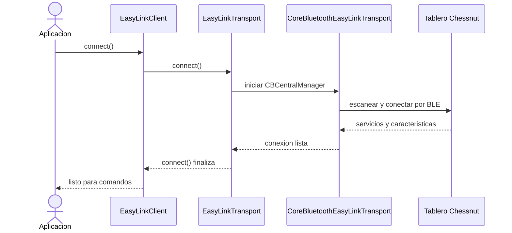
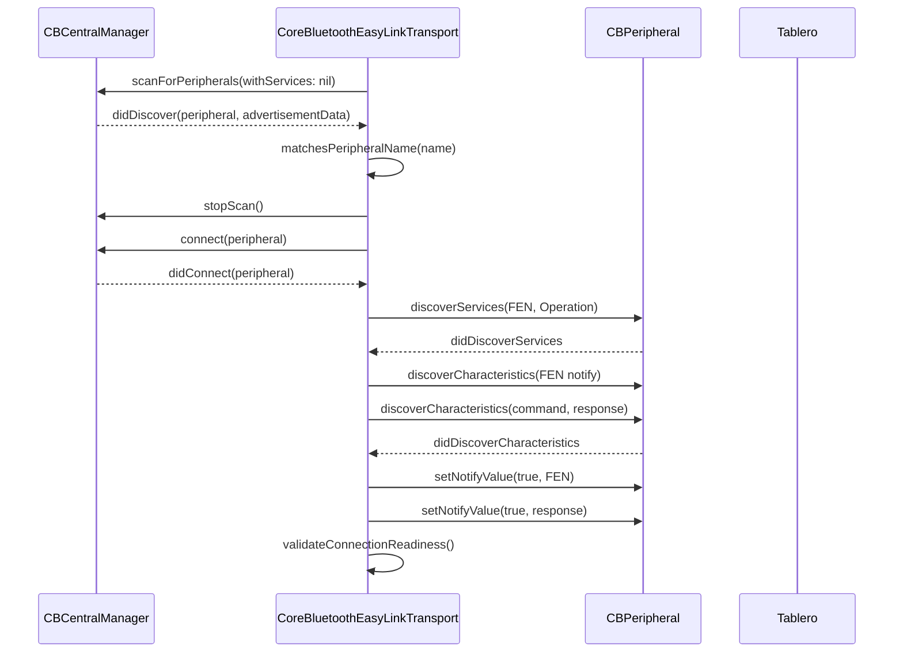
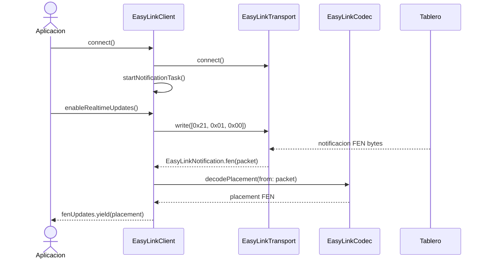
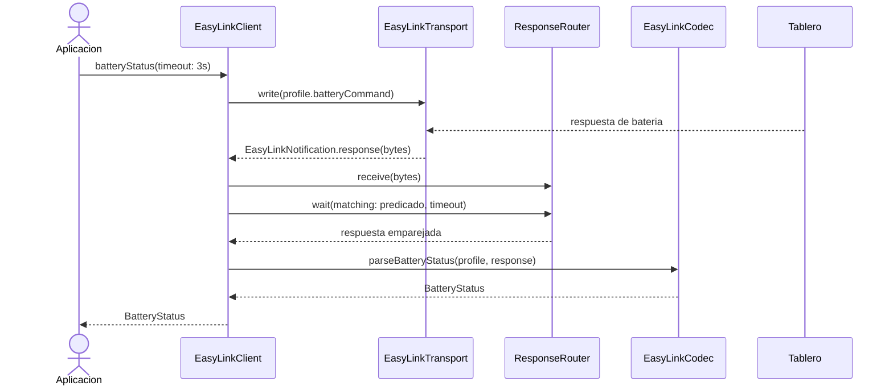
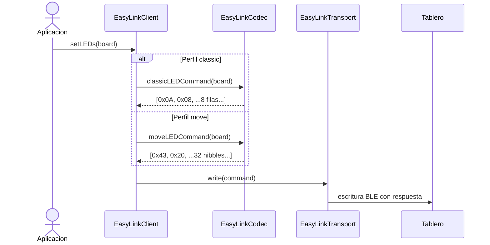
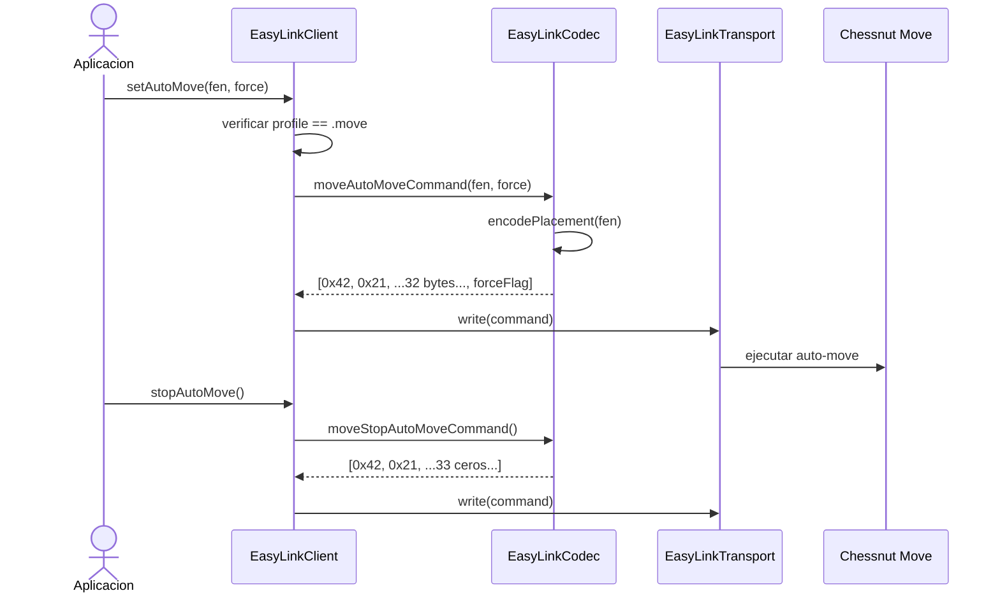
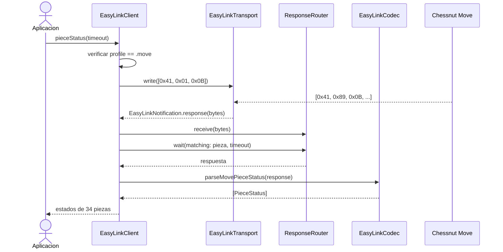
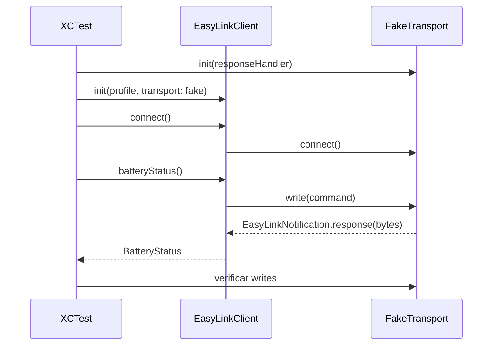

# EasyLinkSwiftSDK - Documentacion en espanol

`EasyLinkSwiftSDK` es una libreria Swift nativa para comunicarse con tableros electronicos Chessnut mediante Bluetooth Low Energy (BLE). El paquete esta escrito como Swift Package Manager, no envuelve el SDK C/C++ original, y expone una API `async/await` con `AsyncStream` para recibir actualizaciones en tiempo real.

## Resumen del paquete

- Nombre del paquete: `EasyLinkSwiftSDK`
- Producto SPM: libreria `EasyLinkSwiftSDK`
- Plataformas soportadas: iOS 16 o superior y macOS 13 o superior
- Transporte incluido: CoreBluetooth
- Perfiles soportados:
  - `BoardProfile.classic`: tableros estilo Chessnut Air, Air+, Go y Pro.
  - `BoardProfile.move`: Chessnut Move.
- Tests incluidos:
  - `EasyLinkCodecTests`: validan codificacion y decodificacion del protocolo.
  - `EasyLinkClientTests`: validan flujos de cliente con un transporte falso.

## Estructura del proyecto

| Ruta | Responsabilidad |
| --- | --- |
| `Package.swift` | Define el paquete SPM, plataformas, producto de libreria y target de tests. |
| `README.md` | Resumen corto de perfiles, UUIDs, comandos y ejemplo basico. |
| `Sources/EasyLinkSwiftSDK/EasyLinkClient.swift` | Fachada publica principal para conectar, enviar comandos y consumir actualizaciones FEN. |
| `Sources/EasyLinkSwiftSDK/CoreBluetoothEasyLinkTransport.swift` | Implementacion BLE real usando `CBCentralManager` y `CBPeripheralDelegate`. |
| `Sources/EasyLinkSwiftSDK/EasyLinkTransport.swift` | Protocolo de transporte inyectable para poder probar o sustituir CoreBluetooth. |
| `Sources/EasyLinkSwiftSDK/EasyLinkCodec.swift` | Codificador y decodificador del protocolo de bytes de Chessnut. |
| `Sources/EasyLinkSwiftSDK/Models.swift` | Modelos publicos: perfil, colores LED, tablero LED, bateria y estado de piezas. |
| `Sources/EasyLinkSwiftSDK/ResponseRouter.swift` | Actor interno que empareja respuestas BLE con llamadas pendientes. |
| `Sources/EasyLinkSwiftSDK/EasyLinkNotification.swift` | Eventos internos del transporte: FEN, respuesta y desconexion. |
| `Sources/EasyLinkSwiftSDK/EasyLinkError.swift` | Errores publicos de la libreria. |
| `Sources/EasyLinkSwiftSDK/ProtocolConstants.swift` | UUIDs BLE, comandos constantes y reglas de deteccion de perfil. |
| `Tests/EasyLinkSwiftSDKTests/FakeTransport.swift` | Transporte falso para tests unitarios sin hardware BLE. |

## Instalacion

Anade el paquete a tu proyecto Swift Package Manager:

```swift
.package(url: "URL_DEL_REPOSITORIO", branch: "main")
```

Despues declara la dependencia en el target que la use:

```swift
.product(name: "EasyLinkSwiftSDK", package: "EasyLinkSwiftSDK")
```

## Uso basico

```swift
import EasyLinkSwiftSDK

let client = EasyLinkClient(profile: .move)

try await client.connect()
try await client.enableRealtimeUpdates()

Task {
  for await fen in client.fenUpdates {
    print("Posicion del tablero:", fen)
  }
}

let battery = try await client.batteryStatus()
print("Bateria:", battery.percentage)
```

La propiedad `fenUpdates` emite solo el campo de colocacion de FEN, por ejemplo:

```text
rnbqkbnr/pppppppp/8/8/8/8/PPPPPPPP/RNBQKBNR
```

No incluye turno, enroques, captura al paso, contador de medio movimiento ni numero de jugada.

## Arquitectura general

La libreria esta organizada en tres capas:

1. API publica de alto nivel: `EasyLinkClient`.
2. Transporte BLE o transporte inyectado: `EasyLinkTransport` y `CoreBluetoothEasyLinkTransport`.
3. Protocolo de bytes: `EasyLinkCodec`, `ProtocolConstants` y `ResponseRouter`.

`EasyLinkClient` no habla directamente con CoreBluetooth. Envia comandos a cualquier objeto que implemente `EasyLinkTransport`, lo que permite probar la libreria con `FakeTransport` o crear transportes alternativos.



## Perfiles de tablero

### `BoardProfile.classic`

Perfil para tableros Chessnut clasicos, detectados por nombre BLE que empieza por `Chessnut` y no es exactamente `Chessnut Move`.

Funcionalidades disponibles:

- Conexion BLE.
- Actualizaciones FEN en tiempo real.
- LEDs monocromaticos por casilla.
- Consulta de bateria.

Comandos principales:

| Funcion | Bytes |
| --- | --- |
| Activar FEN en tiempo real | `[0x21, 0x01, 0x00]` |
| LEDs | `[0x0A, 0x08, ...8 bytes...]` |
| Consulta de bateria | `[0x29, 0x01, 0x00]` |
| Respuesta de bateria esperada | `[0x2A, 0x02, batteryLevel, reserved]` |

### `BoardProfile.move`

Perfil para Chessnut Move, detectado por nombre BLE exactamente igual a `Chessnut Move`.

Funcionalidades disponibles:

- Conexion BLE.
- Actualizaciones FEN en tiempo real.
- LEDs de color por casilla.
- Consulta de bateria.
- Auto-move a partir de una posicion FEN.
- Detencion de auto-move.
- Consulta de estado individual de piezas.

Comandos principales:

| Funcion | Bytes |
| --- | --- |
| Activar FEN en tiempo real | `[0x21, 0x01, 0x00]` |
| Auto-move | `[0x42, 0x21, ...32 bytes de tablero..., forceFlag]` |
| Detener auto-move | `[0x42, 0x21, ...33 bytes en cero...]` |
| LEDs de color | `[0x43, 0x20, ...32 bytes LED...]` |
| Consulta de bateria | `[0x41, 0x01, 0x0C]` |
| Respuesta de bateria esperada | `[0x41, 0x03, 0x0C, charging, batteryLevel]` |
| Consulta de piezas | `[0x41, 0x01, 0x0B]` |
| Respuesta de piezas esperada | `[0x41, 0x89, 0x0B, ...34 registros de 4 bytes...]` |

## Servicios y caracteristicas BLE

Ambos perfiles usan los mismos UUIDs BLE:

| Elemento | UUID |
| --- | --- |
| Servicio FEN | `1b7e8261-2877-41c3-b46e-cf057c562023` |
| Caracteristica de notificaciones FEN | `1b7e8262-2877-41c3-b46e-cf057c562023` |
| Servicio de operaciones | `1b7e8271-2877-41c3-b46e-cf057c562023` |
| Caracteristica de comandos | `1b7e8272-2877-41c3-b46e-cf057c562023` |
| Caracteristica de respuestas | `1b7e8273-2877-41c3-b46e-cf057c562023` |

`CoreBluetoothEasyLinkTransport` escanea perifericos, filtra por nombre segun el perfil, conecta, descubre los servicios anteriores, guarda la caracteristica de comandos y activa notificaciones en las caracteristicas de FEN y respuesta.



## API publica principal

### `EasyLinkClient`

Es el punto de entrada recomendado para consumidores de la libreria.

Propiedades:

- `profile`: perfil elegido para el tablero.
- `fenUpdates`: `AsyncStream<String>` con las posiciones recibidas en tiempo real.

Inicializadores:

```swift
public convenience init(profile: BoardProfile)
public init(profile: BoardProfile, transport: EasyLinkTransport)
```

El inicializador de conveniencia usa `CoreBluetoothEasyLinkTransport`. El inicializador con `transport` permite inyectar un transporte custom para tests, simuladores o integraciones alternativas.

Metodos:

| Metodo | Funcion |
| --- | --- |
| `connect()` | Conecta el transporte y arranca la tarea interna que procesa notificaciones. |
| `disconnect()` | Cancela la tarea de notificaciones y desconecta el transporte. |
| `enableRealtimeUpdates()` | Envia el comando que activa notificaciones FEN en tiempo real. |
| `setLEDs(_:)` | Codifica y envia LEDs segun el perfil activo. |
| `batteryStatus(timeout:)` | Envia una consulta de bateria y espera la respuesta correspondiente. |
| `setAutoMove(fen:force:)` | Solo Chessnut Move. Envia una posicion para auto-move. |
| `stopAutoMove()` | Solo Chessnut Move. Detiene auto-move. |
| `pieceStatus(timeout:)` | Solo Chessnut Move. Devuelve estado de las 34 piezas. |

### Flujo de actualizaciones FEN



Si la decodificacion FEN falla dentro de la tarea de notificaciones, el paquete se ignora porque se usa `try?` al decodificar.

### Flujo de consulta de bateria



`ResponseRouter` acepta respuestas que lleguen antes o despues de la llamada `wait`. Si una respuesta llega antes de que exista una espera compatible, se guarda en un buffer interno.

### Flujo de LEDs



En `classic`, cualquier color distinto de `.off` se traduce como LED encendido en un bit de la fila. En `move`, cada casilla se codifica con un nibble de color:

| `LEDColor` | Valor |
| --- | --- |
| `.off` | `0` |
| `.red` | `1` |
| `.green` | `2` |
| `.blue` | `3` |

### Flujo de auto-move en Chessnut Move



Si se llama `setAutoMove` o `stopAutoMove` con perfil `.classic`, la libreria lanza `EasyLinkError.unsupportedCommand(.classic)`.

### Flujo de estado de piezas en Chessnut Move



Cada `PieceStatus` contiene:

- `index`: indice del registro.
- `piece`: pieza esperada para ese indice.
- `identityCode`: identificador fisico o codigo de identidad reportado por el tablero.
- `x`: coordenada X reportada.
- `y`: coordenada Y reportada.
- `batteryPercentage`: bateria de esa pieza.

## Modelos publicos

### `BoardProfile`

```swift
public enum BoardProfile: Sendable, Equatable {
  case classic
  case move
}
```

Selecciona el protocolo de comandos y las reglas de deteccion del periferico.

### `LEDColor`

```swift
public enum LEDColor: UInt8, Sendable, Equatable {
  case off = 0
  case red = 1
  case green = 2
  case blue = 3
}
```

Representa colores soportados por la API de LEDs. En tableros clasicos solo se usa encendido/apagado.

### `LEDBoard`

```swift
public struct LEDBoard: Sendable, Equatable {
  public private(set) var colors: [[LEDColor]]
}
```

Representa una matriz de 8x8 colores. El inicializador valida que existan 8 filas y 8 columnas. Tambien incluye:

- `LEDBoard.allOff`: tablero completo apagado.
- `subscript(rankIndex:fileIndex:)`: lectura y escritura de una casilla.

Ejemplo:

```swift
var board = LEDBoard.allOff
board[rankIndex: 0, fileIndex: 7] = .blue
try await client.setLEDs(board)
```

### `BatteryStatus`

```swift
public struct BatteryStatus: Sendable, Equatable {
  public var percentage: Int
  public var isCharging: Bool?
}
```

En ambos perfiles el SDK intenta devolver porcentaje. `isCharging` puede representar estado de carga si el protocolo lo informa o si puede deducirse del byte recibido.

### `PieceStatus`

```swift
public struct PieceStatus: Sendable, Equatable {
  public var index: Int
  public var piece: Character
  public var identityCode: UInt8
  public var x: UInt8
  public var y: UInt8
  public var batteryPercentage: Int
}
```

Solo se usa para Chessnut Move. El parser espera 34 registros de 4 bytes.

## Codificacion y decodificacion del protocolo

### FEN

`EasyLinkCodec.decodePlacement(from:)` espera paquetes de al menos 34 bytes. La colocacion se lee desde los bytes `[2]...[33]`, dos casillas por byte, usando nibbles.

Tabla de piezas:

| Codigo | Pieza |
| --- | --- |
| `0` | casilla vacia |
| `1` | `q` |
| `2` | `k` |
| `3` | `b` |
| `4` | `p` |
| `5` | `n` |
| `6` | `R` |
| `7` | `P` |
| `8` | `r` |
| `9` | `B` |
| `10` | `N` |
| `11` | `Q` |
| `12` | `K` |

`EasyLinkCodec.encodePlacement(_:)` acepta un FEN completo, pero solo usa la primera seccion antes del primer espacio. Valida:

- 8 ranks separados por `/`.
- Cada rank debe sumar exactamente 8 casillas.
- Solo piezas soportadas por la tabla.
- Digitos de vacio entre 1 y 8.

### LEDs

`classicLEDCommand(_:)` produce 10 bytes:

```text
[0x0A, 0x08, fila0, fila1, fila2, fila3, fila4, fila5, fila6, fila7]
```

`moveLEDCommand(_:)` produce 34 bytes:

```text
[0x43, 0x20, ...32 bytes de datos LED...]
```

### Bateria

`parseBatteryStatus(profile:response:)` interpreta respuestas distintas por perfil:

- Classic: valida `0x2A, 0x02`; el porcentaje es `response[2] & 0x7F` y carga es el bit alto.
- Move: valida `0x41, 0x03, 0x0C`; carga es `response[3] == 1` y porcentaje es `response[4]`.

### Estado de piezas

`parseMovePieceStatus(response:)` valida cabecera `0x41, 0x89, 0x0B` y despues interpreta 34 registros de 4 bytes:

```text
[identityCode, x, y, batteryPercentage]
```

## Transporte BLE

`CoreBluetoothEasyLinkTransport` implementa `EasyLinkTransport`.

Responsabilidades principales:

- Crear `CBCentralManager` en una cola serial propia.
- Esperar a que Bluetooth este `poweredOn`.
- Escanear perifericos BLE.
- Filtrar perifericos por nombre segun `BoardProfile`.
- Conectar al periferico.
- Descubrir servicios FEN y operaciones.
- Descubrir caracteristicas de comando, respuesta y notificacion FEN.
- Activar notificaciones BLE.
- Escribir comandos con respuesta (`CBCharacteristicWriteType.withResponse`).
- Publicar eventos en `AsyncStream<EasyLinkNotification>`.

Eventos emitidos:

| Evento | Significado |
| --- | --- |
| `.fen([UInt8])` | Paquete de notificacion FEN recibido. |
| `.response([UInt8])` | Respuesta de comando recibida. |
| `.disconnected` | El transporte se desconecto. |

## Transporte custom

La abstraccion `EasyLinkTransport` permite sustituir CoreBluetooth:

```swift
public protocol EasyLinkTransport: AnyObject {
  var notifications: AsyncStream<EasyLinkNotification> { get }

  func connect() async throws
  func disconnect() async
  func write(_ command: [UInt8]) async throws
}
```

Esto es util para:

- Tests unitarios.
- Simuladores de tablero.
- Integraciones con otro stack BLE.
- Captura/reproduccion de paquetes.
- Herramientas de diagnostico.

El test target usa `FakeTransport`, que guarda los comandos escritos y puede responder automaticamente si un closure reconoce el comando.



## Errores

`EasyLinkError` agrupa los fallos esperados:

| Error | Caso tipico |
| --- | --- |
| `bluetoothUnavailable` | Bluetooth apagado, no autorizado, no soportado o estado desconocido no recuperable. |
| `connectionFailed(String)` | CoreBluetooth no pudo conectar y no entrego un error mas especifico. |
| `disconnected` | Se intenta escribir sin periferico conectado o sin caracteristica de comando lista. |
| `invalidPacket(String)` | Respuesta o notificacion con formato inesperado. |
| `invalidFEN(String)` | FEN invalido al codificar una posicion. |
| `invalidLEDBoard(String)` | Matriz LED que no es 8x8. |
| `unsupportedCommand(BoardProfile)` | Comando exclusivo de Move usado con perfil classic. |
| `timeout` | No llego respuesta compatible dentro del tiempo configurado. |

## Tests existentes

La suite actual cubre:

- Decodificacion de posicion inicial desde paquete FEN.
- Decodificacion de paquetes FEN de longitud 38 bytes.
- Round-trip de codificacion/decodificacion para todos los codigos de pieza soportados.
- Rechazo de FEN invalido.
- Comando LED classic de 8 filas.
- Comando LED Move en orden de nibbles compatible con FEN.
- Comando de auto-move Move.
- Comando de stop auto-move Move.
- Parseo de bateria classic.
- Parseo de bateria Move.
- Parseo de estado de piezas Move.
- Conexion, activacion de tiempo real y emision de `fenUpdates`.
- Consulta de bateria mediante request-response.
- Seleccion de codificacion LED segun perfil.
- Rechazo de comandos Move-only en classic.
- Consulta y parseo de `pieceStatus`.

## Ejemplos de uso

### Conectar y leer FEN en tiempo real

```swift
let client = EasyLinkClient(profile: .classic)

try await client.connect()
try await client.enableRealtimeUpdates()

Task {
  for await placement in client.fenUpdates {
    print(placement)
  }
}
```

### Consultar bateria

```swift
let status = try await client.batteryStatus(timeout: .seconds(5))
print(status.percentage)

if let isCharging = status.isCharging {
  print(isCharging ? "Cargando" : "No cargando")
}
```

### Encender LEDs

```swift
var leds = LEDBoard.allOff
leds[rankIndex: 6, fileIndex: 4] = .red
leds[rankIndex: 7, fileIndex: 4] = .blue

try await client.setLEDs(leds)
```

### Auto-move en Chessnut Move

```swift
let moveClient = EasyLinkClient(profile: .move)
try await moveClient.connect()

try await moveClient.setAutoMove(
  fen: "8/8/8/3k4/4K3/8/8/8",
  force: true
)

try await moveClient.stopAutoMove()
```

### Estado de piezas en Chessnut Move

```swift
let statuses = try await moveClient.pieceStatus()

for piece in statuses {
  print(piece.index, piece.piece, piece.x, piece.y, piece.batteryPercentage)
}
```

## Consideraciones operativas

- `connect()` no recibe timeout explicito. Si el entorno BLE no produce eventos esperados, el consumidor depende del comportamiento de CoreBluetooth y del estado del manager.
- El escaneo usa `withServices: nil` y filtra despues por nombre. Esto maximiza descubrimiento, pero puede ver mas perifericos de los necesarios.
- `disconnect()` emite `.disconnected` y limpia referencias internas del transporte.
- Los comandos se escriben con respuesta BLE; la continuacion de escritura se resuelve en `didWriteValueFor`.
- El cliente crea una tarea interna para consumir `transport.notifications`.
- Las respuestas de comando se emparejan por predicado, no por identificador de correlacion formal.
- `LEDBoard` valida dimensiones al inicializar, pero el subscript asume indices validos.

## Posibles mejoras de la libreria

1. Anadir timeout configurable a `connect()` para evitar esperas indefinidas durante escaneo, conexion o descubrimiento de servicios.
2. Exponer una API de escaneo y seleccion manual de periferico, util cuando hay varios tableros Chessnut cerca.
3. Filtrar el escaneo por servicios BLE cuando sea viable, reduciendo ruido y consumo durante discovery.
4. Completar todas las continuaciones de escritura pendientes si ocurre una desconexion o error BLE antes de `didWriteValueFor`.
5. Proteger mejor llamadas concurrentes a `connect()`, porque actualmente existe una sola `connectContinuation` interna.
6. Convertir parte del estado de `CoreBluetoothEasyLinkTransport` a un actor o aislarlo con una estrategia de concurrencia mas estricta para reducir el uso de `@unchecked Sendable`.
7. Exponer errores de paquetes FEN invalidos en vez de ignorarlos silenciosamente con `try?`.
8. Limitar o limpiar el buffer de `ResponseRouter` para evitar crecimiento indefinido si llegan respuestas que nadie consume.
9. Anadir modelos de casilla/rank/file tipados para evitar trabajar con indices `Int` crudos en `LEDBoard`.
10. Validar bounds en el subscript de `LEDBoard` o proporcionar metodos seguros de lectura/escritura por casilla.
11. Ampliar `LEDColor` si el hardware soporta mas colores o intensidades.
12. Ofrecer helpers para convertir entre coordenadas de ajedrez (`e4`) e indices `rankIndex/fileIndex`.
13. Permitir construir un FEN completo anadiendo turno, enroques, captura al paso y contadores cuando la app lo necesite.
14. Documentar publicamente el sistema de coordenadas usado por FEN, LEDs y estado de piezas.
15. Anadir tests de timeout, desconexion, respuestas fuera de orden y multiples requests simultaneas.
16. Anadir tests de integracion opcionales con hardware real detras de una bandera o scheme separado.
17. Exponer un modo de logging o tracing de paquetes BLE para diagnostico.
18. Anadir DocC (`.docc`) para generar documentacion navegable desde Xcode.
19. Publicar ejemplos completos para iOS/macOS con permisos Bluetooth y ciclo de vida de UI.
20. Separar API publica de codec de bajo nivel si se quiere mantener una superficie publica mas pequena y estable.
